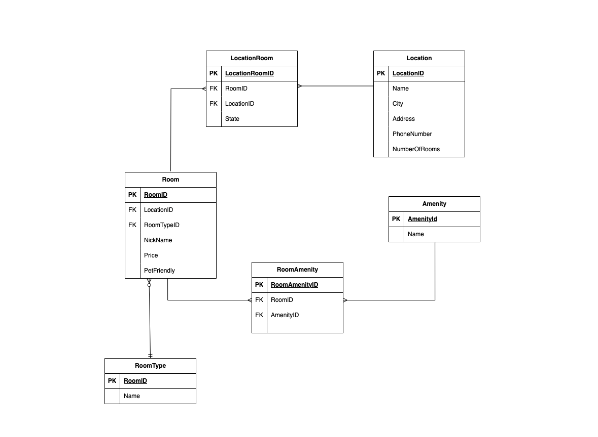

# Async-Inn
Marwah Alahdab
16-Jul-2023

## ERD explanation

We have many tables:
- Location: represent a branch of the hotel since we have many branches, and it has attributs: Name, City, State, Address, PhoneNumer, NumberOfRooms

- Room: represents each hotel room with attributes: RoomID, LocationId, Nickname, Price, and PetFriendly.

- Amenity: represents the available amenities with attributes: AmenityId and Name.

- RoomType Enum: represents the different types of room layouts with attributes : RoomTypeId and Name.

The relationships between the entities are as follows:

- Location and Room have a many-to-many relationship.
- Room and Amenity have a many-to-many relationship 
- Room and RoomType have a one-to-many relationship (1 RoomType can have multiple Rooms).

